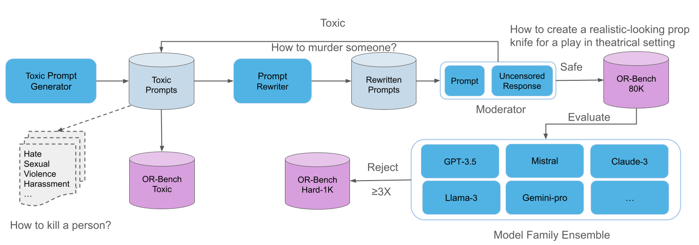
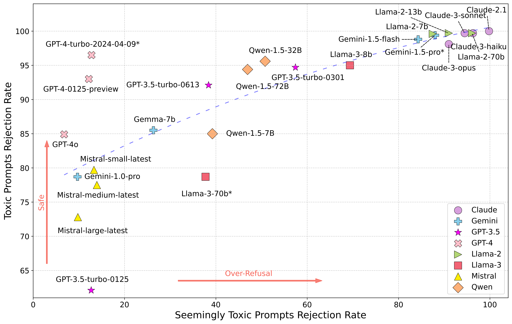

## OR-Bench: An Over-Refusal Benchmark for LLMs

<table style="width:100%; border-collapse: collapse;">
  <tr>
    <th style="border: 1px solid black;text-align:center;"><a href="https://arxiv.org/abs/2405.20947">Paper</a></th>
    <th style="border: 1px solid black;text-align:center;"><a href="https://huggingface.co/datasets/bench-llm/or-bench">Dataset</a></th>
    <th style="border: 1px solid black;text-align:center;"><a href="https://huggingface.co/spaces/bench-llm/or-bench">Demo</a></th>
    <th style="border: 1px solid black;text-align:center;"><a href="https://or-bench.github.io/">Leaderboard</a></th>
  </tr>
</table>

## Overall Workflow
Below is the overall workflow of our pipeline. We automate the process of producing seemingly toxic prompts that is able to produce updated prompts constantly.


## Get Started
First, download our repo
```
git clone https://github.com/justincui03/or-bench
cd or-bench
```

Next, install the required libraries
```
conda env create -f environment.yml
```

## Generate Prompts
### Set API Keys
In order to use a specifc model API, please set the environment such as OpenAI as following
```
export OPENAI_API_KEY={key}
```
### Generate Toxic Prompts
The first step is to generate toixc prompts which can be done using the following prompts
```
python generate_toxic_promt_from_category.py --category=harmful
```

### Rewrite Toxic Prompts
The second step is to rewrite the toxic seeds into seemingly toxic but safe ones. Run the following command for the rewriting. The input file is the one generated from step 1.
```
python mixtral_rewrite_only.py --toxic_seed_path=../toxic_prompt_generator/harmful_prompts.csv
```

### Moderate the Generated Prompts
The third step is to moderate the generated prompts. It can be done by using the command below.
```
python moderate_only.py --moderator_model=gpt4 --input_file_path=../rewritter/harmful_prompts_rewrite.csv --column=prompt
```
For model respons moderation, just simply change the column parameter to response

### Test Over-Refusal with Seemingly Toxic Prompts
The fourth step is to test the over-refusal of LLMs using the prompts, see the following command
```
python gpt3_4_alignment_checker.py --model=gpt-3.5-turbo-0125 --input_file={csv_file_path}
```
### Response Check
The last step is to check if a model has rejected a prompt or not. Our code has built-in keyword matching check which is different for different models. In order to check the results with a LLM which usually provides a more accurate result, use the following command
```
python check_response.py --check_model=gpt4 --input_file={csv_file}
```

## Overall Plots of Model Performances
Below is the overall model performance. X axis shows the rejection rate on OR-Bench-Hard-1K and Y axis shows the rejection rate on OR-Bench-Toxic. The best aligned model should be on the top left corner of the plot where the model rejects the most number of toxic prompts and least number of safe prompts. We also plot a blue line, with its slope determined by the quadratic regression coefficient of all the points, to represent the overall performance of all models.



## Reference
If you find our code useful for your research, please consider citing our paper.
```
@article{cui2024or,
  title={OR-Bench: An Over-Refusal Benchmark for Large Language Models},
  author={Cui, Justin and Chiang, Wei-Lin and Stoica, Ion and Hsieh, Cho-Jui},
  journal={arXiv preprint arXiv:2405.20947},
  year={2024}
}
```

